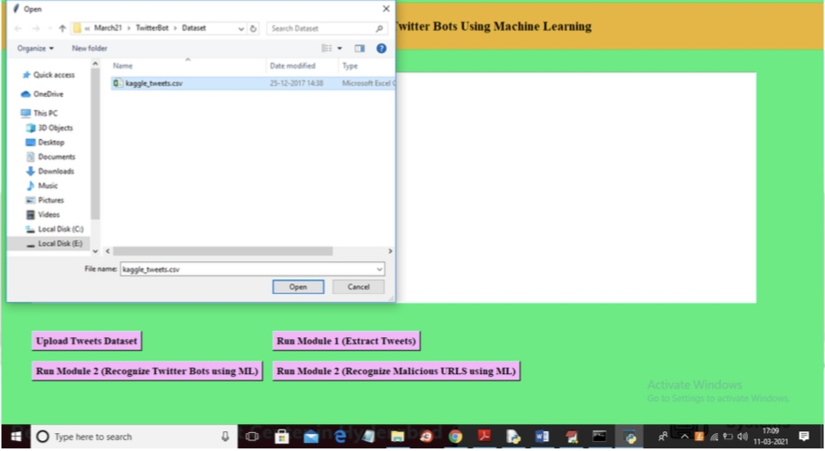
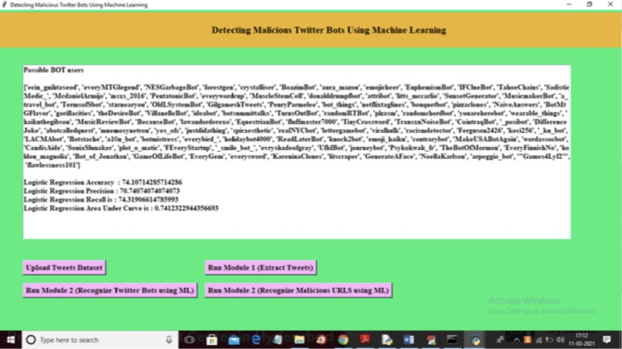
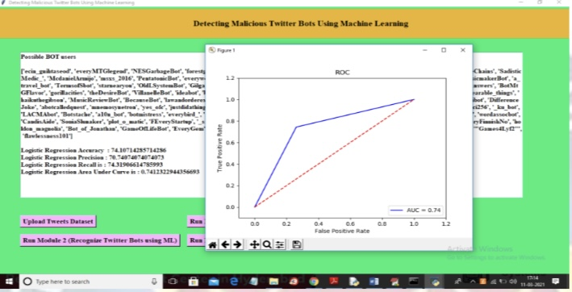
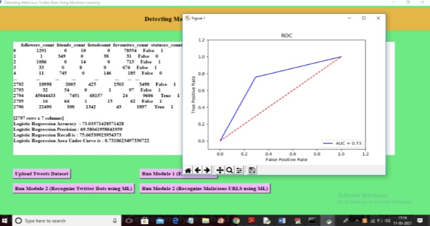

[](https://colab.research.google.com/github/mohammed-imad-umar/detecting-twitter-bots-ml/blob/main/src/Main.ipynb)


# 🤖 Detecting Twitter Bots using Machine Learning

### 📌 Project Overview
A machine learning-based system to identify and flag malicious Twitter bots with **74% accuracy**.  
The model analyzes user behavior, account metadata, tweet frequency, and URL patterns to differentiate between human users and bots.

---

### 🚀 Key Features
- ✅ Real-time and offline Twitter data analysis  
- ✅ Feature extraction: Tweet frequency, followers/following ratio, account metadata  
- ✅ Logistic Regression classifier with 74% detection accuracy  
- ✅ GUI built using Tkinter for user-friendly interaction  
- ✅ Malicious URL detection module  

---

### 🛠️ Tech Stack
- **Languages:** Python  
- **Libraries:** Pandas, NumPy, Scikit-Learn, Matplotlib, Seaborn, Tkinter  
- **Tools:** Jupyter Notebook, GitHub, Google Colab

---

### 📂 Project Structure
```
detecting-twitter-bots-ml/
│── data/                 # Dataset files
│── docs/                 # Screenshots & visualizations
│── notebooks/            # Jupyter Notebooks
│── src/                  # Source code (model scripts)
│── requirements.txt      # Dependencies
│── README.md             # Project documentation
│── LICENSE               # MIT License
```

---

### 📊 Model Performance
- **Logistic Regression Accuracy:** 74%  
- Evaluated using Confusion Matrix, Precision, Recall, and ROC Curve.  

---

### 🚀 How to Run
1️⃣ Clone the repository:
```bash
git clone https://github.com/mohammed-imad-umar/detecting-twitter-bots-ml.git
```

2️⃣ Install dependencies:
```bash
pip install -r requirements.txt
```

3️⃣ Run the project:
- Open `src/Main.ipynb` in Jupyter or Colab  
- OR double-click `src/run.bat` for GUI version  

---

### 📸 Screenshots & Visualizations

#### 🔹 GUI & Output Screens:




#### 🔹 Performance Graphs:




---

### 📫 Contact
[](mailto:imadu1525@gmail.com)
[](https://www.linkedin.com/in/mohammed-imad-umar)
[](https://leetcode.com/mohammed_imad_umar)

⭐ *"Detecting fake accounts, one bot at a time!"*
